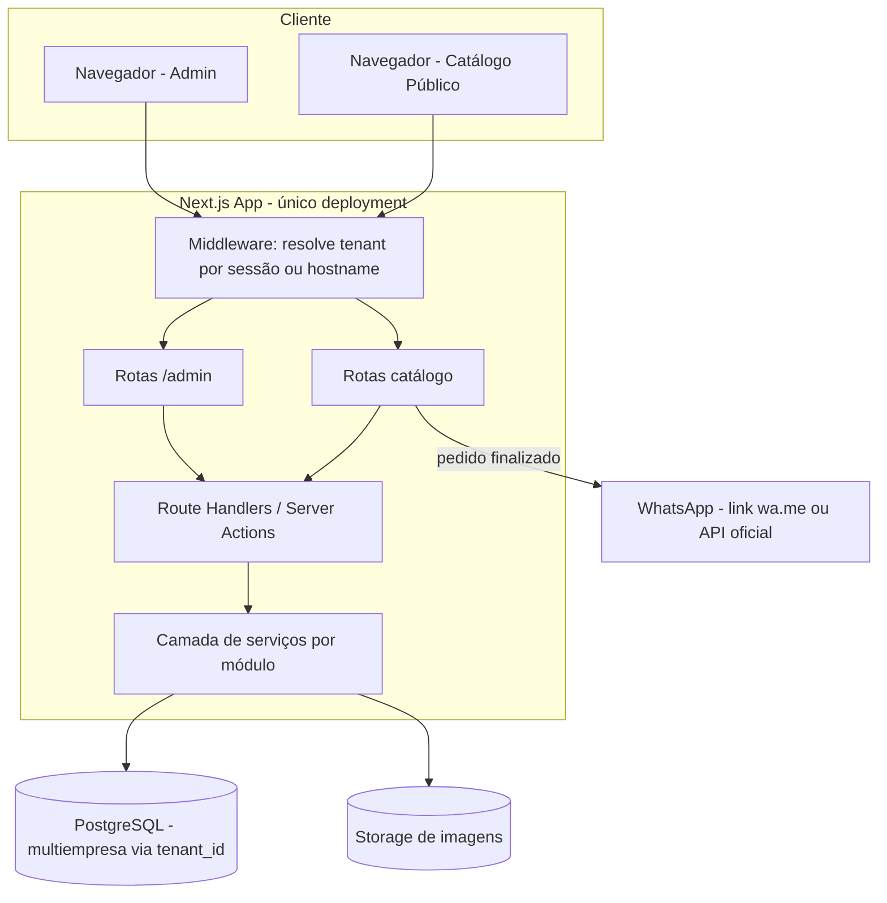

# PLANO_DO_PROJETO.md
## Eficaz Gestão — Sistema próprio de Gestão Comercial e PDV

> Documento vivo. Deve ser atualizado a cada fase concluída ou decisão relevante.

---

## 0. Princípios do projeto

- Referência conceitual: sistemas de gestão comercial/PDV como categoria de mercado (ex.: NEX/Nextar), **sem** reaproveitar código, layout, textos, nomes de telas, paleta de marca ou qualquer ativo protegido.
- Identidade visual, nomenclatura de telas, textos de interface e estrutura de banco são criações originais do Eficaz Gestão.
- Desenvolvimento incremental: cada fase deve ser testável isoladamente antes de avançar.
- Multiempresa desde o desenho do banco (`tenant_id`), mesmo usando uma única empresa (EficazBr) no início.
- Idioma: pt-BR. Moeda: R$ 0,00 (real brasileiro). Fuso: `America/Sao_Paulo`.

---

## 1. Módulos funcionais

| # | Módulo | Responsabilidade |
|---|--------|-------------------|
| 1 | Autenticação & Empresa (Tenant) | Login, recuperação de senha, dados da empresa, branding, domínio |
| 2 | Usuários & Permissões | Papéis, permissões customizadas, auditoria |
| 3 | Produtos | Cadastro, variações, categorias, marcas, importação/exportação |
| 4 | Estoque | Entradas/saídas, ajustes, inventário, alertas |
| 5 | PDV & Caixa | Venda presencial, pagamentos, abertura/fechamento de caixa, sangria/suprimento |
| 6 | Clientes | CRM básico, histórico de compras |
| 7 | Fornecedores | Cadastro e vínculo com produtos/entradas |
| 8 | Catálogo Online | Vitrine pública sincronizada com o estoque |
| 9 | Pedidos Online | Recebimento, status, integração WhatsApp |
| 10 | Relatórios | Vendas, lucro, estoque, desempenho |
| 11 | Domínio Próprio | Subdomínio padrão, domínio customizado, SSL |
| 12 | Multiempresa & Planos | Isolamento de dados por tenant, limites de plano (futuro SaaS) |

---

## 2. Arquitetura recomendada

### 2.1 Visão geral

Aplicação **Next.js (App Router) full-stack** único deployment, atendendo três "faces":

1. **Painel administrativo** (`/admin/...`) — autenticado, por tenant.
2. **Catálogo público** (`/` ou domínio customizado) — resolvido por hostname.
3. **API interna** (`app/api/...` ou Route Handlers) consumida pelo próprio front.

Não recomendamos, no MVP, separar um backend dedicado (ex.: NestJS): adicionaria complexidade operacional (dois deploys, dois times de config, CORS) sem benefício real neste estágio. Um backend separado pode ser extraído depois, se a escala/exigências (ex.: workers assíncronos pesados) justificarem.

### 2.2 Multi-tenant

- Estratégia: **banco compartilhado + coluna `tenant_id`** em todas as tabelas de negócio (conforme solicitado).
- Resolução de tenant:
  - Painel administrativo: tenant vem da sessão do usuário autenticado (usuário pertence a 1 tenant).
  - Catálogo público: tenant resolvido por **hostname** via middleware (`subdominio.eficazgestao.com.br` ou domínio próprio cadastrado) → carrega tenant e aplica no lookup de produtos/pedidos.
- Toda query de dado de negócio passa por uma camada que injeta `tenant_id` automaticamente (evita vazamento entre empresas). Ponto crítico de segurança — tratado como requisito, não opcional.

### 2.3 Autenticação

- Sessão via cookies HTTP-only (JWT ou sessão em banco).
- Senhas com hash `bcrypt`/`argon2`, nunca texto puro.
- Recuperação de senha por token de uso único + expiração, enviado por e-mail.
- Middleware de autorização por rota, checando papel/permissão antes de renderizar ou responder API.

### 2.4 Camadas internas (dentro do app Next.js)

```
Request → Route Handler / Server Action
        → Validação (Zod)
        → Camada de serviço (regras de negócio, por módulo)
        → Camada de acesso a dados (Prisma, sempre com tenant_id)
        → Resposta
```

- Regras de negócio (ex.: baixa de estoque ao vender, cálculo de troco, reserva de estoque em pedido) ficam na camada de serviço — nunca direto no componente de UI.
- Toda alteração relevante (produto, estoque, venda, pedido, usuário) grava em `AuditLog`.

### 2.5 Diagrama lógico



---

## 3. Mapa de telas

### Autenticação
- Login
- Esqueci minha senha / Redefinir senha

### Onboarding / Empresa
- Cadastro da empresa (nome, CNPJ, contato)
- Configurações da empresa: dados gerais, logotipo, cores, endereço
- Configuração de domínio (subdomínio padrão, domínio próprio, instruções DNS, status de validação)

### Dashboard
- Painel inicial: resumo de vendas, faturamento, lucro estimado, estoque baixo, mais vendidos

### Produtos
- Lista de produtos (busca, filtros, status)
- Cadastro/edição de produto (dados, preços, imagens, variações)
- Categorias (lista/cadastro)
- Marcas (lista/cadastro)
- Importação/exportação CSV/Excel

### Estoque
- Movimentações (lista + novo lançamento entrada/saída/ajuste)
- Inventário
- Alertas de estoque baixo
- Relatório de produtos parados / mais vendidos

### PDV
- Tela de venda (busca produto, carrinho, pagamento, troco, comprovante)
- Abertura de caixa
- Fechamento de caixa
- Sangria / Suprimento
- Histórico de vendas / cancelamento

### Clientes
- Lista de clientes
- Cadastro/edição
- Ficha do cliente (histórico, total gasto, última compra)

### Fornecedores
- Lista de fornecedores
- Cadastro/edição
- Produtos vinculados / histórico de entradas

### Catálogo Online (público)
- Página inicial (banner, categorias, destaques, promoções)
- Listagem de produtos com filtros
- Página de produto (fotos, descrição, preço, disponibilidade, relacionados)
- Carrinho
- Finalizar pedido (retirada/entrega, forma de pagamento, WhatsApp)

### Pedidos Online (admin)
- Lista de pedidos com status (Kanban ou tabela)
- Detalhe do pedido (cliente, itens, endereço, pagamento, ações de status)
- Configuração de taxas de entrega por bairro/CEP

### Relatórios
- Vendas por período
- Faturamento e lucro bruto
- Ticket médio
- Produtos mais vendidos / maior margem
- Vendas por forma de pagamento
- Vendas por vendedor
- Cancelamentos
- Movimentações de caixa
- Exportação

### Usuários & Permissões
- Lista de usuários
- Cadastro/edição de usuário e papel
- Permissões customizadas
- Log de auditoria

---

## 4. Modelo inicial do banco de dados (rascunho Prisma)

> Este é o modelo conceitual inicial. Será refinado a cada fase — campos de fases futuras (ex.: `Order`, `Plan`) entram no schema apenas quando a fase correspondente for implementada.

```prisma
// prisma/schema.prisma (rascunho conceitual — não definitivo)

model Tenant {
  id            String   @id @default(cuid())
  name          String
  tradeName     String?
  document      String?  // CNPJ
  logoUrl       String?
  primaryColor  String?
  secondaryColor String?
  phone         String?
  whatsapp      String?
  addressStreet String?
  addressNumber String?
  addressCity   String?
  addressState  String?
  addressZip    String?
  subdomain     String   @unique
  customDomain  String?  @unique
  domainStatus  String?  // pending | verified | active
  timezone      String   @default("America/Sao_Paulo")
  currency      String   @default("BRL")
  stockPolicy   String   @default("RESERVE") // RESERVE | DEDUCT (baixa em pedido online)
  createdAt     DateTime @default(now())
  updatedAt     DateTime @updatedAt

  users       User[]
  products    Product[]
  customers   Customer[]
  suppliers   Supplier[]
  // ...demais relações
}

enum UserRole {
  ADMIN
  MANAGER
  SELLER
  STOCKIST
  CUSTOM
}

model User {
  id           String   @id @default(cuid())
  tenantId     String
  name         String
  email        String
  passwordHash String
  role         UserRole
  active       Boolean  @default(true)
  lastLoginAt  DateTime?
  createdAt    DateTime @default(now())

  tenant       Tenant   @relation(fields: [tenantId], references: [id])
  permissions  UserPermission[]

  @@unique([tenantId, email])
}

model UserPermission {
  id       String @id @default(cuid())
  userId   String
  resource String // ex.: "products", "pdv", "reports"
  action   String // ex.: "read", "write", "delete"

  user User @relation(fields: [userId], references: [id])
}

model Category {
  id        String   @id @default(cuid())
  tenantId  String
  name      String
  parentId  String?

  tenant   Tenant     @relation(fields: [tenantId], references: [id])
  parent   Category?  @relation("CategoryToCategory", fields: [parentId], references: [id])
  children Category[] @relation("CategoryToCategory")
}

model Brand {
  id       String @id @default(cuid())
  tenantId String
  name     String
}

model Product {
  id             String   @id @default(cuid())
  tenantId       String
  name           String
  internalCode   String?
  barcode        String?
  categoryId     String?
  brandId        String?
  description    String?
  costPrice      Decimal
  salePrice      Decimal
  promoPrice     Decimal?
  stockQty       Int      @default(0)
  minStock       Int      @default(0)
  supplierId     String?
  active         Boolean  @default(true)
  showInCatalog  Boolean  @default(true)
  createdAt      DateTime @default(now())
  updatedAt      DateTime @updatedAt

  tenant   Tenant   @relation(fields: [tenantId], references: [id])
  images   ProductImage[]
  variants ProductVariant[]

  @@unique([tenantId, internalCode])
}

model ProductImage {
  id        String @id @default(cuid())
  productId String
  url       String
  order     Int    @default(0)

  product Product @relation(fields: [productId], references: [id])
}

model ProductVariant {
  id            String  @id @default(cuid())
  productId     String
  name          String  // ex.: "Cor: Preto / Tamanho: M"
  sku           String?
  barcode       String?
  priceAdjustment Decimal @default(0)
  stockQty      Int     @default(0)

  product Product @relation(fields: [productId], references: [id])
}

enum StockMovementType {
  IN
  OUT
  ADJUST
  SALE
  CANCEL_RETURN
}

model StockMovement {
  id        String   @id @default(cuid())
  tenantId  String
  productId String
  variantId String?
  type      StockMovementType
  quantity  Int
  reason    String?
  userId    String
  createdAt DateTime @default(now())
}

model Customer {
  id             String    @id @default(cuid())
  tenantId       String
  name           String
  document       String?
  phone          String?
  whatsapp       String?
  email          String?
  addressStreet  String?
  addressCity    String?
  notes          String?
  totalSpent     Decimal   @default(0)
  lastPurchaseAt DateTime?
  createdAt      DateTime  @default(now())

  tenant Tenant @relation(fields: [tenantId], references: [id])
}

model Supplier {
  id       String  @id @default(cuid())
  tenantId String
  name     String
  document String?
  phone    String?
  email    String?

  tenant Tenant @relation(fields: [tenantId], references: [id])
}

model CashRegister {
  id             String    @id @default(cuid())
  tenantId       String
  openedBy       String
  openedAt       DateTime  @default(now())
  openingAmount  Decimal
  closedBy       String?
  closedAt       DateTime?
  closingAmount  Decimal?
  status         String    @default("OPEN") // OPEN | CLOSED
}

enum CashMovementType {
  WITHDRAWAL // sangria
  SUPPLY     // suprimento
}

model CashMovement {
  id             String   @id @default(cuid())
  cashRegisterId String
  type           CashMovementType
  amount         Decimal
  description    String?
  userId         String
  createdAt      DateTime @default(now())
}

enum SaleStatus {
  COMPLETED
  CANCELLED
}

model Sale {
  id             String     @id @default(cuid())
  tenantId       String
  cashRegisterId String
  customerId     String?
  sellerId       String
  status         SaleStatus @default(COMPLETED)
  subtotal       Decimal
  discount       Decimal    @default(0)
  total          Decimal
  createdAt      DateTime   @default(now())
  cancelledAt    DateTime?
  cancelReason   String?

  items    SaleItem[]
  payments Payment[]
}

model SaleItem {
  id        String  @id @default(cuid())
  saleId    String
  productId String
  variantId String?
  quantity  Int
  unitPrice Decimal
  discount  Decimal @default(0)
  total     Decimal
}

enum PaymentMethod {
  CASH
  PIX
  DEBIT
  CREDIT
}

model Payment {
  id           String        @id @default(cuid())
  saleId       String
  method       PaymentMethod
  amount       Decimal
  changeAmount Decimal?
}

model AuditLog {
  id        String   @id @default(cuid())
  tenantId  String
  userId    String
  action    String
  entity    String
  entityId  String
  before    Json?
  after     Json?
  createdAt DateTime @default(now())
}
```

> Modelos de **Fase 4 em diante** (`Order`, `OrderItem`, `DeliveryZone`, `Plan`) serão adicionados ao schema quando essas fases começarem, para manter as migrações pequenas e revisáveis.

---

## 5. Fases de desenvolvimento

### Fase 1 — Estrutura, autenticação e empresa ✅ CONCLUÍDA
- Setup do projeto Next.js + TypeScript + Tailwind + Prisma + PostgreSQL.
- Modelo `Tenant`, `User`, autenticação (login, logout, recuperação de senha).
- Cadastro/edição da empresa (dados, branding básico).
- Proteção de rotas do painel (`src/proxy.ts` + DAL em `src/lib/session.ts`).
- Layout base do painel administrativo.

**Pendência conhecida:** o link de recuperação de senha é escrito no log do servidor;
falta conectar um provedor de e-mail transacional (ex.: Resend) para envio real.

### Fase 2 — Produtos e estoque ✅ CONCLUÍDA
- CRUD de produtos (preços, estoque, variações, imagem por URL), categorias, marcas e fornecedores.
- Busca por nome / código interno / código de barras.
- Importação e exportação CSV (`src/modules/products/import-service.ts`).
- Movimentações de estoque (entrada, saída, ajuste), inventário, histórico com usuário responsável.
- Alertas de reposição — regra em `src/modules/products/stock-status.ts`:
  `esgotado` quando `stockQty <= 0`; `estoque baixo` quando `minStock > 0 && stockQty <= minStock`.
  Produtos sem mínimo configurado não são marcados como "baixos" apenas por estarem zerados.
- Dashboard passou a exibir contagem real de produtos e lista de reposição.

**Pendências conhecidas:**
- Upload de arquivos de imagem (hoje é URL manual) — depende de configurar o Cloudinary.
- Importação da planilha atual do NEX — precisa do arquivo real para mapear as colunas.
- Variações agora baixam estoque próprio na venda (Fase 3), mas ainda não aparecem nas
  movimentações manuais de estoque.

### Fase 3 — PDV e caixa ✅ CONCLUÍDA
- **Clientes** (`/clientes`): CRUD, ficha com total gasto, última compra e histórico de compras.
- **Caixa** (`/caixa`): abertura com valor inicial, sangria e suprimento, fechamento com
  conferência (valor contado × esperado, com a diferença destacada) e histórico de caixas.
  Só pode haver um caixa aberto por empresa ao mesmo tempo.
- **PDV** (`/pdv`): busca por nome/código interno/EAN. Código de barras exato entra direto no
  carrinho (o scanner USB atua como teclado e envia Enter). Carrinho com ajuste de quantidade
  limitado ao estoque, seleção de cliente, desconto sujeito a permissão, pagamento único ou
  dividido entre dinheiro/PIX/débito/crédito, e cálculo de troco.
- **Vendas** (`/vendas`): histórico com filtro por status, comprovante imprimível
  (`window.print()`, com `print:hidden` nos controles) e cancelamento com justificativa
  obrigatória que devolve o estoque.
- **Permissões** (`src/lib/permissions.ts`): o menu lateral e as ações respeitam o papel.
  Vendedor não concede desconto nem cancela venda; estoquista não vende.
- **Dashboard**: faturamento, nº de vendas, lucro bruto e ticket médio do dia (fuso de
  São Paulo), mais vendidos e produtos a repor. Valores financeiros ficam ocultos para
  papéis sem permissão de relatórios.

**Decisões de implementação relevantes:**
- Toda venda é gravada numa única transação (`src/modules/sales/sale-service.ts`): numeração,
  itens, pagamentos, baixa de estoque e movimentações. Se algo falhar, nada é gravado — o
  estoque nunca fica divergente de uma venda pela metade.
- Os preços **nunca** vêm do navegador: são relidos do banco no servidor, então não é possível
  forjar valores. O preço promocional tem precedência sobre o preço de venda.
- A numeração da venda usa um contador no `Tenant` incrementado atomicamente na transação,
  o que garante números únicos mesmo com vendas simultâneas.
- O item da venda guarda `nameSnapshot`, `unitPrice` e `unitCost` do momento da venda, para
  que o comprovante histórico e a apuração de lucro não mudem se o produto for editado depois.
- O "esperado na gaveta" considera **apenas dinheiro em espécie** — PIX e cartão não passam
  pelo caixa físico. Vendas canceladas são excluídas do total.

**Pendências conhecidas:**
- O comprovante é uma impressão A4/navegador. Impressora térmica (ESC/POS) não foi implementada.
- Sem emissão fiscal (NFC-e/SAT) — o comprovante é declaradamente "sem valor fiscal".
- Não há venda a prazo/crediário nem parcelamento no cartão (o valor entra integral).
- Produtos com vendas registradas não podem ser excluídos (o histórico precisa permanecer
  íntegro) — o botão de excluir fica desabilitado e a regra é reforçada no servidor. Para
  retirar o produto de circulação, desative-o.

### Fase 4 — Catálogo online ✅ CONCLUÍDA
- **Vitrine pública** em `/loja/[subdominio]`, lendo o mesmo banco do PDV. Um produto só
  aparece se estiver **ativo** e com **"Mostrar no catálogo online"** marcado — preço e estoque
  acompanham o PDV automaticamente, sem sincronização.
- **Resolução por domínio** (`src/modules/catalog/tenant-resolver.ts`): o `proxy.ts` reescreve
  `subdominio.<ROOT_DOMAIN>` para `/loja/[subdominio]`, mantendo a URL limpa. Em
  desenvolvimento, `eficazbr.localhost:3000` funciona direto no Chrome.
- **Home**: banner personalizado (título, subtítulo e imagem), atalhos de categoria e as
  seções Promoções, Mais vendidos (ranking real de vendas) e Novidades.
- **Listagem** com busca, filtro por categoria e marca, 4 ordenações e paginação — os filtros
  se combinam e são preservados na navegação.
- **Página do produto**: galeria com miniaturas, descrição, preço normal riscado quando há
  promoção, disponibilidade, seletor de variação (opções esgotadas desabilitadas) e
  relacionados da mesma categoria.
- **Carrinho** do visitante persistido no navegador, com badge no cabeçalho.
- **Configuração** em `/configuracoes/catalogo`: liga/desliga a loja, define banner e logotipo,
  e mostra o link público e a contagem de produtos visíveis.

**Decisões de implementação relevantes:**
- Coluna derivada `Product.catalogPrice` (= promocional, senão preço de venda), mantida por
  `computeCatalogPrice` em **todos** os caminhos de escrita (cadastro, edição e importação CSV).
  Sem ela, ordenar por "menor preço" ignoraria as promoções — um produto de R$ 49,90 em promoção
  a R$ 39,90 apareceria depois de outro de R$ 39,90.
- O carrinho usa `useSyncExternalStore` (`src/modules/catalog/cart-store.ts`) em vez de
  `useState` + efeito: assim ler o `localStorage` não dispara `setState` durante a montagem
  (evita renderizações em cascata) e o HTML do servidor hidrata sem divergência.
- Imagens usam `` em vez de `next/image`: as URLs são cadastradas livremente pela empresa,
  então o domínio não é conhecido em build time para configurar `images.remotePatterns`.
  Ao migrar para o Cloudinary (domínio fixo e conhecido), vale trocar para `next/image`.
- A cor principal da empresa é injetada como variável CSS `--store-primary` no layout da loja.

**Pendências conhecidas:**
- Finalização do pedido (entrega/retirada, pagamento, envio ao WhatsApp) é a **Fase 5** — o
  botão do carrinho está desabilitado com aviso explícito.
- Sem filtro por faixa de preço (só ordenação) e sem múltiplas imagens por upload.
- Domínio próprio com SSL é a **Fase 7**; a coluna `customDomain` e a busca por ela já existem.

### Fase 5 — Pedidos e WhatsApp ✅ CONCLUÍDA
- **Checkout** (`/loja/[subdominio]/checkout`): dados de contato, escolha entre entrega e
  retirada, endereço, forma de pagamento (com troco), observações e resumo com a taxa.
- **Taxa de entrega por região** (`DeliveryZone`): casa por **bairro** (ignorando acentos e
  maiúsculas) ou por **faixa de CEP**. Sem faixa correspondente, o pedido segue com "a combinar".
- **Confirmação** (`/loja/[subdominio]/pedido/[id]`) com resumo e botão que abre o WhatsApp da
  loja já com a mensagem formatada.
- **Painel de pedidos** (`/pedidos`): lista filtrável com contadores por status, e detalhe com
  linha do tempo, avanço de status, cancelamento com justificativa e botão para falar com o
  cliente no WhatsApp.
- **Configuração** (`/configuracoes/entrega`): liga/desliga entrega e retirada, define a
  política de estoque, instruções de retirada e as faixas de entrega.

**Decisões de implementação relevantes:**
- **Política de estoque** (`Tenant.stockPolicy`), configurável pela loja:
  - `RESERVE` (padrão): o estoque só sai quando o pedido é **concluído** — evita furar o
    estoque do balcão com pedidos que podem não se confirmar;
  - `DEDUCT`: o estoque sai assim que o pedido chega — garante o produto para quem pediu online.
  Em ambos, o pedido só é aceito se houver estoque no momento, e `Order.stockDeductedAt`
  impede baixa dupla ao avançar o status. Cancelar um pedido já baixado devolve o estoque.
- Os preços e a taxa de entrega **nunca** vêm do navegador: são relidos/recalculados no
  servidor, então o carrinho do visitante não consegue forjar valores.
- `StockMovement.userId` virou opcional: um pedido online é feito por um visitante sem login,
  então a movimentação `ORDER` não tem usuário responsável (aparece como "Pedido online").
- Rótulos e fluxo de status ficam em `src/modules/orders/order-status.ts`, **sem** acesso ao
  banco — componentes de cliente precisam deles, e importar o `order-service` (que carrega o
  Prisma) arrastaria módulos do Node (`net`, `dns`) para o bundle do navegador.
- O pedido guarda os dados de contato digitados no checkout e só **vincula** um `Customer`
  existente quando o telefone bate; concluir o pedido soma no total gasto desse cliente.

**Pendências conhecidas:**
- O botão "Enviar pelo WhatsApp" só aparece se o campo **WhatsApp** estiver preenchido em
  Configurações da empresa. Vazio, o cliente vê um aviso para procurar a loja pelos outros canais.
- O envio ao WhatsApp é por link `wa.me` — o cliente (ou o lojista) precisa apertar "enviar".
  O envio automático exige a API oficial da Meta (decisão registrada abaixo).
- Sem notificação (e-mail/push) quando um pedido novo chega — é preciso abrir o painel.
- Sem histórico de mudanças de status (só o status atual e a data de cancelamento).
- O pedido online não vira uma `Sale` no PDV — os relatórios da Fase 6 somam as duas origens
  (resolvido).

### Fase 6 — Relatórios ✅ CONCLUÍDA
- **Vendas** (`/relatorios`): faturamento, lucro bruto com margem, nº de vendas e ticket médio;
  quebras por origem (balcão × catálogo), forma de pagamento, vendedor e dia a dia; lista de
  cancelamentos com motivo e responsável.
- **Produtos** (`/relatorios/produtos`): mais vendidos, maior margem realizada, produtos a
  repor e produtos parados (com estoque e sem venda no período, com o valor imobilizado).
- **Caixa** (`/relatorios/caixa`): fechamentos com esperado × contado × diferença, e o extrato
  de sangrias e suprimentos.
- **Período** com atalhos (hoje, ontem, 7 dias, 30 dias, este mês) preservado ao trocar de aba.
- **Exportação CSV** de qualquer um dos três relatórios, no período selecionado.

**Decisões de implementação relevantes:**
- O faturamento soma **duas origens**: vendas do PDV (`Sale`) e pedidos do catálogo já
  **concluídos** (`Order`). Um pedido só entra depois de concluído — antes disso é intenção de
  compra, não receita. Cancelados nunca entram.
- A **taxa de entrega sai do cálculo do lucro bruto**: é repasse ao entregador, não margem de
  produto. Sem isso a margem apareceria inflada.
- O **desconto dado na venda é rateado entre os itens** na proporção do valor de cada um
  (`getProductPerformance`). Sem o rateio, a soma do faturamento por produto ficava maior que o
  faturamento real — no teste, R$ 1.979,20 contra R$ 1.879,20 — e a margem do produto aparecia
  otimista demais (32,35% em vez dos 28,12% reais).
- O CSV usa **ponto e vírgula** como separador e **vírgula decimal**, com BOM UTF-8: é o formato
  que o Excel em português abre direto, sem assistente de importação nem acento quebrado.
- Datas usam o fuso `America/Sao_Paulo` com deslocamento fixo de −03:00 (o Brasil não tem mais
  horário de verão desde 2019).

**Pendências conhecidas:**
- Exportação só em CSV; PDF não foi implementado.
- Sem gráficos — as comparações usam barras proporcionais simples.
- O relatório por vendedor cobre apenas vendas do PDV; pedidos do catálogo aparecem agrupados
  como "Catálogo online", já que não têm vendedor associado.
- Sem comparativo com o período anterior (ex.: "+12% vs. mês passado").

### Fase 7 — Domínio próprio ✅ CONCLUÍDA
- **Cadastro do domínio** (`/configuracoes/dominio`): aceita o endereço com ou sem `https://`,
  com `www` ou barras, e normaliza. Recusa domínios do próprio sistema e domínios já
  conectados a outra loja.
- **Verificação de posse por registro TXT** em `_eficaz-gestao.<dominio>`. A escolha do TXT
  (em vez de exigir o apontamento) permite que a empresa comprove a posse **antes** de tirar
  do ar o site que já tem naquele endereço.
- **Instruções de DNS** na tela, com campos de copiar — inclusive o aviso de que muitos
  provedores não aceitam CNAME no domínio raiz (usar ALIAS/ANAME ou apontar o `www`).
- **Status em quatro etapas** (`DomainStatus`): `NONE` → `PENDING` → `VERIFIED` → `ACTIVE`.
  `ACTIVE` só quando a posse está provada **e** o domínio já aponta para a aplicação.
- **Resolução no proxy**: um domínio verificado passa a servir o catálogo da loja, com cache
  em memória de 60s para não consultar o banco a cada requisição.

**Decisões de implementação relevantes:**
- Só domínios com posse **verificada** resolvem no proxy — um domínio apenas cadastrado não
  pode sequestrar a loja de outra empresa.
- O cache é invalidado ao salvar, verificar ou remover o domínio, para a mudança valer na hora
  em vez de esperar os 60s.
- Se o banco estiver indisponível, a resolução do domínio devolve o último valor conhecido em
  vez de derrubar a requisição.
- O alvo do CNAME vem de `NEXT_PUBLIC_APP_HOST` — muda conforme a hospedagem, sem mexer no código.
- **SSL** é responsabilidade da hospedagem: Vercel emite e renova o certificado automaticamente
  quando o domínio aponta para o projeto. Não há nada a instalar no sistema.

**Correção de robustez feita nesta fase:**
Uma sessão apontando para uma empresa inexistente (empresa excluída, ou banco trocado)
derrubava **toda página do painel com erro 500**. Agora `requireTenant()` detecta o caso e
manda para `/sessao-expirada`, que encerra a sessão antes de ir ao login — redirecionar direto
para `/login` não resolveria, porque o cookie continuaria válido e o proxy devolveria o
usuário ao painel, em laço.

**Pendências conhecidas:**
- Falta o passo de registrar o domínio **na hospedagem** (na Vercel, adicionar o domínio ao
  projeto via painel ou API) — sem isso o CNAME aponta para um servidor que não reconhece o
  host. Automatizar exige a API da Vercel e entra junto com o deploy.
- Nenhum teste com um domínio real e DNS configurado: o fluxo foi validado com domínio
  fictício, verificando que a consulta DNS real acontece e retorna a mensagem correta.
- Sem verificação automática periódica: a empresa precisa clicar em "Verificar agora".
- O `www` é normalizado para o domínio raiz no cadastro; servir os dois exige o redirecionamento
  configurado no provedor de DNS ou na hospedagem.

### Fase 8 — Usuários, permissões e planos ✅ CONCLUÍDA
- **Usuários** (`/usuarios`): criar com papel e senha provisória, trocar papel, ativar/desativar
  e redefinir senha. Mostra último acesso e o consumo do plano.
- **Registro de atividades** (`/usuarios/atividades`): quem fez o quê e quando, nas ações
  sensíveis — cancelamento de venda e de pedido, ajuste de estoque, inventário e mudanças de
  usuário.
- **Planos** (`/configuracoes/plano`): plano atual, barras de uso (com alerta ao chegar em 80%)
  e comparação dos três planos.
- **Limites aplicados no servidor** ao criar usuário e produto — a interface esconde o botão,
  mas quem barra de fato é a Server Action.

**Decisões de implementação relevantes:**
- **A empresa nunca fica sem administrador ativo**: o sistema recusa rebaixar ou desativar o
  último admin, e ninguém pode desativar a própria conta. Sem isso, um clique errado deixaria
  a empresa sem quem gerencia usuários e configurações — sem saída pela interface.
- Administrador **inativo não conta** como administrador para essa regra.
- Os limites dos planos ficam em `src/lib/plans.ts`, não no banco: ajustar um plano vale para
  todas as empresas de uma vez, sem migração.
- O log de auditoria **nunca derruba a operação auditada**: se a gravação falhar, a venda ou o
  cancelamento já aconteceu e desfazer o trabalho do usuário por causa do histórico seria pior.
- O log guarda o **nome de quem agiu** além do vínculo, para o histórico continuar legível se
  o usuário for removido depois.

**Pendências conhecidas:**
- Troca de plano é manual (não há tela de upgrade nem cobrança). Integração com meio de
  pagamento não foi feita.
- Não há convite por e-mail: o administrador define uma senha provisória e combina com a pessoa.
- Permissões customizadas por usuário (além dos quatro papéis) não foram implementadas.
- Auditoria cobre as ações sensíveis atuais; criação/edição de produtos e clientes não entram.
- Onboarding de novas empresas existe (`/cadastro`), mas sem verificação de e-mail nem
  aprovação — qualquer pessoa pode criar uma empresa.

---

## 6. MVP vs Futuro

**Entra no MVP (Fases 1–3, uso interno EficazBr):**
- Autenticação, empresa, usuários/papéis básicos.
- Produtos, categorias, estoque, alertas.
- PDV completo com caixa, pagamentos, cancelamento.
- Relatórios essenciais de vendas/estoque (versão simples, antes do módulo completo da Fase 6).

**Fica para depois do MVP:**
- Catálogo online público e pedidos (Fases 4–5).
- Relatórios avançados (Fase 6 completa).
- Domínio próprio customizado (Fase 7).
- Multiempresa/SaaS completo com planos e cobrança (Fase 8).
- Permissões customizadas granulares (MVP usa papéis fixos: Admin, Gerente, Vendedor, Estoquista).
- Importação da planilha atual do NEX (mapeamento specific será feito quando houver acesso ao arquivo real).

---

## 7. Estrutura de pastas sugerida

```
eficaz-gestao/
├── prisma/
│   ├── schema.prisma
│   └── migrations/
├── public/
├── src/
│   ├── app/
│   │   ├── (auth)/
│   │   │   ├── login/
│   │   │   └── recuperar-senha/
│   │   ├── (admin)/
│   │   │   ├── dashboard/
│   │   │   ├── produtos/
│   │   │   ├── estoque/
│   │   │   ├── pdv/
│   │   │   ├── clientes/
│   │   │   ├── fornecedores/
│   │   │   ├── pedidos/
│   │   │   ├── relatorios/
│   │   │   ├── usuarios/
│   │   │   └── configuracoes/
│   │   ├── (catalogo)/
│   │   │   ├── page.tsx
│   │   │   ├── produto/[slug]/
│   │   │   └── carrinho/
│   │   └── api/
│   │       └── ... (route handlers por módulo)
│   ├── modules/
│   │   ├── auth/
│   │   ├── tenant/
│   │   ├── products/
│   │   ├── stock/
│   │   ├── pdv/
│   │   ├── customers/
│   │   ├── suppliers/
│   │   ├── catalog/
│   │   ├── orders/
│   │   └── reports/
│   │       (cada módulo: services/, repositories/, schemas/, types/)
│   ├── components/
│   │   ├── ui/           # componentes reutilizáveis (botão, input, tabela...)
│   │   └── layout/
│   ├── lib/
│   │   ├── prisma.ts
│   │   ├── auth.ts
│   │   ├── tenant-context.ts
│   │   └── audit-log.ts
│   ├── middleware.ts
│   └── styles/
├── docs/
│   └── PLANO_DO_PROJETO.md
├── .env.example
├── package.json
└── tsconfig.json
```

---

## 8. Ferramentas e serviços necessários

- **Runtime/Linguagem:** Node.js LTS, TypeScript
- **Framework:** Next.js (App Router)
- **UI:** Tailwind CSS + componentes reutilizáveis (base headless, estilo próprio)
- **ORM/Banco:** Prisma + PostgreSQL
- **Autenticação:** solução baseada em sessão/JWT com hash bcrypt/argon2
- **Validação:** Zod (frontend e backend)
- **Formulários:** React Hook Form
- **E-mail transacional:** serviço de envio (para recuperação de senha)
- **Armazenamento de imagens:** serviço compatível com S3 (a definir — ver decisões pendentes)
- **Hospedagem:** provedor de nuvem para app + banco (a definir)
- **Versionamento:** Git + GitHub
- **Qualidade:** ESLint, Prettier, testes (Vitest/Jest + Testing Library)
- **Datas/fuso:** date-fns/dayjs com timezone America/Sao_Paulo
- **Logs/auditoria:** tabela `AuditLog` própria (+ logger estruturado, ex. Pino)

---

## 9. Riscos técnicos e decisões pendentes

| # | Tema | Risco/Consideração | Recomendação |
|---|------|---------------------|--------------|
| 1 | Hospedagem app + banco | Custo, facilidade de deploy, suporte a domínios customizados por tenant | A confirmar com o usuário |
| 2 | Armazenamento de imagens | S3/R2 exige mais configuração; Cloudinary é mais simples para começar | A confirmar com o usuário |
| 3 | Integração WhatsApp | API oficial (Meta Business) exige verificação de negócio, custo e prazo; link `wa.me` é gratuito e imediato, porém manual | A confirmar com o usuário |
| 4 | Autenticação | Biblioteca pronta (Auth.js/NextAuth) acelera, mas adiciona dependência; solução própria dá mais controle e é mais simples de auditar num app deste porte | A confirmar com o usuário |
| 5 | Domínio próprio + SSL multi-tenant | Depende do provedor de hospedagem escolhido (nem todos automatizam SSL por domínio customizado) | Definido junto com item 1, na Fase 7 |
| 6 | Leitura de código de barras no PDV | Scanners USB/Bluetooth comuns emulam teclado (HID) — não exigem driver especial; scanners que exigem SDK proprietário ficam fora do escopo inicial | Assumido HID por padrão |
| 7 | Planilha atual do NEX | Estrutura de colunas ainda não conhecida | Mapear quando o arquivo for compartilhado |

Estes pontos serão levantados diretamente com o usuário antes do início da Fase 1.

---

## 10. Histórico de decisões

| Data | Decisão | Escolha |
|------|---------|---------|
| 2026-07-29 | Hospedagem app + banco | **Vercel** (Next.js) + **Neon** (PostgreSQL serverless) |
| 2026-07-29 | Armazenamento de imagens | **Cloudinary** |
| 2026-07-29 | Integração WhatsApp (MVP) | **Link `wa.me`** com mensagem formatada (API oficial Meta fica para fase futura) |
| 2026-07-29 | Autenticação | **Auth.js (NextAuth)** com provider de credenciais (e-mail/senha) |
| 2026-07-29 | E-mail do usuário | Único **globalmente**, não por empresa — simplifica o login. Revisar na Fase 8 se um mesmo e-mail precisar administrar várias empresas. |
| 2026-07-29 | Bundler | `next dev`/`next build` rodam com **`--webpack`**: a política de controle de aplicativos do Windows nesta máquina bloqueia o binário nativo do Turbopack. Reverter para Turbopack é só remover a flag do `package.json`. |
| 2026-07-29 | Banco de desenvolvimento | PostgreSQL temporário provisionado via `npx create-db` (expira em ~24h). O `CLAIM_URL` no `.env` permite torná-lo permanente. Produção usará o Neon. |
| 2026-07-29 | Lógica de negócio testável | Regras que não dependem de requisição ficam em `src/modules/<dominio>/` (ex.: `products/import-service.ts`, `products/stock-status.ts`); as Server Actions são invólucros finos que só resolvem sessão/tenant e delegam. Permite testar sem subir o servidor. |
| 2026-07-30 | Permissões | Derivadas do papel do usuário em `src/lib/permissions.ts`. Vendedor vende e abre caixa, mas **não** concede desconto nem cancela venda; estoquista gerencia produtos/estoque mas não vende. Permissões customizadas por usuário ficam para a Fase 8. |
| 2026-07-30 | Caixa | Apenas **um caixa aberto por empresa** de cada vez. O "esperado na gaveta" conta somente dinheiro em espécie (abertura + vendas em dinheiro + suprimentos − sangrias); PIX e cartão não passam pelo caixa físico. |
| 2026-07-30 | Integridade da venda | Venda gravada em transação única, com preços relidos do servidor e numeração via contador atômico no `Tenant`. Itens guardam nome/preço/custo do momento da venda (snapshot). |
| 2026-07-30 | Exclusão de produtos | Produto com venda registrada não é excluído, apenas desativado — preserva o histórico e a apuração de lucro. |
| 2026-07-30 | Comprovante | Impressão via navegador (`window.print()`), declaradamente sem valor fiscal. Impressora térmica ESC/POS e emissão fiscal (NFC-e/SAT) não fazem parte do MVP. |
| 2026-07-30 | Largura de botões | `Button` expõe `fullWidth` em vez de aceitar `w-auto` por `className`: o Tailwind resolve conflitos pela ordem na folha de estilo, então `w-full` da classe base vencia e todos os botões "estreitos" saíam largos. |
| 2026-07-30 | Rota do catálogo | Canônica em `/loja/[subdominio]`; o `proxy.ts` reescreve o acesso por subdomínio/domínio próprio para ela. Facilita testar em `localhost` e mantém uma única implementação. |
| 2026-07-30 | Preço do catálogo | Coluna derivada `Product.catalogPrice` para ordenar/filtrar pelo preço real (com promoção) no banco, mantida por `computeCatalogPrice` em todas as escritas. |
| 2026-07-30 | Pasta do projeto | O projeto está dentro do OneDrive, que trava arquivos de `.next` durante a sincronização (`EBUSY`) e derruba o servidor de desenvolvimento. Recomendado excluir `.next` e `node_modules` da sincronização, ou mover o projeto para fora do OneDrive. |
| 2026-07-30 | Estoque de pedidos online | Configurável por empresa: `RESERVE` (baixa ao concluir, padrão) ou `DEDUCT` (baixa na entrada). `Order.stockDeductedAt` garante que a baixa aconteça uma vez só. |
| 2026-07-30 | Taxa de entrega | Definida por faixas (`DeliveryZone`) com bairro e/ou intervalo de CEP, sempre calculada no servidor. Sem faixa correspondente, o valor fica "a combinar" em vez de bloquear o pedido. |
| 2026-07-30 | Separação cliente/servidor | Constantes e regras puras (rótulos, fluxo de status) ficam em módulos sem import do Prisma. Componentes `"use client"` só podem importar desses — o contrário quebra o build com `Module not found: net/dns`. |
| 2026-07-30 | Schema de formulário vs. de servidor | O formulário valida só o que está na tela (`checkoutFormSchema`); o servidor valida o payload completo com os itens (`checkoutSchema`). Validar no formulário um campo que não é exibido faz o envio falhar em silêncio. Todo formulário deve ter `handleSubmit(onSubmit, onInvalid)` para nunca "não fazer nada". |
| 2026-07-30 | Busca de endereço por CEP | **ViaCEP** (`viacep.com.br`), API pública e gratuita, sem chave. Falha ou CEP inexistente cai no preenchimento manual — nunca bloqueia o pedido. Campos já digitados pelo cliente não são sobrescritos. |
| 2026-07-30 | Faturamento nos relatórios | Soma vendas do PDV e pedidos do catálogo **concluídos**. Taxa de entrega é excluída do lucro bruto (repasse, não margem) e o desconto da venda é rateado entre os itens no relatório por produto. |
| 2026-07-30 | Formato do CSV | Separador `;` e vírgula decimal, com BOM UTF-8 — abre direto no Excel em português, sem assistente de importação e sem acento quebrado. |
| 2026-07-30 | Dados de demonstração | `npm run seed:demo` recria empresa, produtos, clientes, vendas e pedidos de exemplo num banco vazio. |
| 2026-07-30 | Banco de dados (definitivo) | Migrado do Postgres temporário para o **Neon**, projeto "Eficazbr Gestão" na região **AWS São Paulo (sa-east-1)**. Plano gratuito permanente: 0,5 GB, 100 CU-horas/mês, sem cartão. O banco hiberna quando ocioso — a primeira consulta após parado leva alguns segundos. |
| 2026-07-30 | Conexão direta × pooler | O `.env` usa a conexão **direta** (sem `-pooler`): as migrações do Prisma precisam de sessão dedicada e falham no pooler. Na Vercel, o app deve usar a versão **com** `-pooler`, porque o ambiente serverless abre muitas conexões curtas. |
| 2026-07-30 | Verificação de domínio | Por registro **TXT** em `_eficaz-gestao.<dominio>`, não pelo apontamento. Assim a empresa prova a posse sem precisar tirar do ar o site que já tem naquele endereço. Só domínios verificados resolvem no proxy. |
| 2026-07-30 | Cache de domínio no proxy | Mapeamento domínio → loja cacheado 60s em memória: o proxy roda em toda requisição e consultar o banco sempre deixaria o catálogo lento. Invalidado ao salvar/verificar/remover o domínio. |
| 2026-07-30 | Sessão órfã | `requireTenant()` valida se a empresa da sessão ainda existe e, se não, encerra a sessão via `/sessao-expirada`. Páginas do painel que carregam a empresa devem usar esse helper em vez de `findUniqueOrThrow`, que estourava erro 500. |
